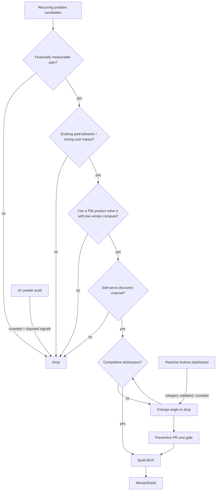

# Research decision graph

## Why the selected branch survived

- The pain is recurring and denominated in real compute spend.
- Current GitHub pricing makes runner choice, runtime, matrix size, and trigger frequency economically meaningful.
- Existing static linters and historical dashboards validate demand but leave room for a calibrated pre-merge dollar delta.
- GitHub Marketplace plus search-oriented calculator/docs supports self-serve discovery.
- The free product can run on customer compute, keeping vendor infrastructure near zero during validation.
